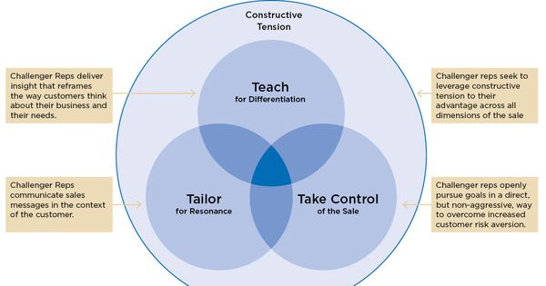
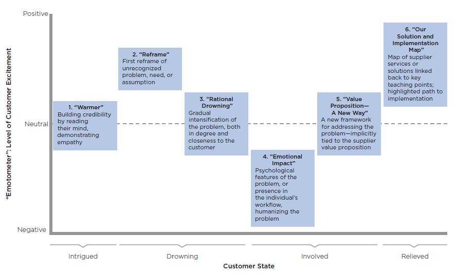

# The Challenger Sale: Taking Control of the Customer Conversation

## Sales Rep Profiles

- **The Challenger**
  - Different view of world
  - Understands the customer's business
  - Loves debating
  - Push Customer's thinking
- The Lone Wolf
  - Follows own instincts
  - Doesn't follow the rules
  - Self-assured
  - Difficult to manage
- The Hard Worker
  - Willing to go the extra mile
  - Doesn't give up easily
  - Self-motivated
  - Interested in feedback and development  
- The Reactive Problem Solver
  - Reliably responds to internal and external stakeholders
  - Ensures all problems are solved
  - Detail oriented
- The Relationship Builder
  - Builds strong advocates in customer organization
  - Generous in giving time to help others
  - Gets along with everyone

## Key Skills for the Challenger

- All skills need to be evenly applied for best results otherwise you risk the engagement

- 

### Teaching (Most important)

- 53% of customer loyalty comes from the sales experience. Don't waste their time instead take time to provide interesting and valuable information
- Most important areas of focus for providing valuable insight
  - "Rep offers unique and valuable perspectives on the market."
  - "Rep helps me navigate the alternatives."
  - "Rep provides ongoing advice or consultation."
  - "Rep educates me on new issues and outcomes."
  - "Supplier is easy to buy from."
  - "Supplier has widespread support across my organization."
- The customer wants to learn something! (Give them insight)
- Not just any teaching-- **Commercial** teaching
  - Teach the customer something new, get the excited, then customer puts the idea out to bid and you lose. *Bad Idea....*
  - 4 Key Rules:
    - Lead to your unique strengths.
      - What makes your solution special vs others that offer similar solutions.
      - "Why should the customer buy from you over anyone else?"
      - Make a connection between the insight you teach and the product you sell.
    - Challenge customers' assumptions.
      - Reframe the way the customer thinks about their business.
      - Make the customer say, "Huh, I never thought about it that way" *--success!*
      - Don't make the customer say, "I totally agree, that is what was keeping me up at night" *--failure!*
    - Catalyze action.
      - Customers lose attention easily.
      - Make them focus by showing the money/ROI they would leave on the table by **NOT** buying your solution, or the extra money they will spend **NOT** buying your product.
      - Then sweep in the show the total ROI of your solution.
    - Scale across all customers.
      - Don't expect to perform everything for every customer.
      - Work in segmentations, not industry or geography or product silos, but instead with problem sets. I.E. freeing up cash, reducing employee churn, & improving workplace safety.
      - Rely on the back office to help find the issues your customers have, so you can then figure out the solution and how to present it.
  - Building insight (It's not easy but here is a breakdown!)
    - Tell a compelling story (not a presentation)
    - Six key steps

    - 
    - "Lead to, not with!"
    - Don't let who you are, who you have worked with, and what your solution is come first. Lead the audience to it at the end with a build up.
    
