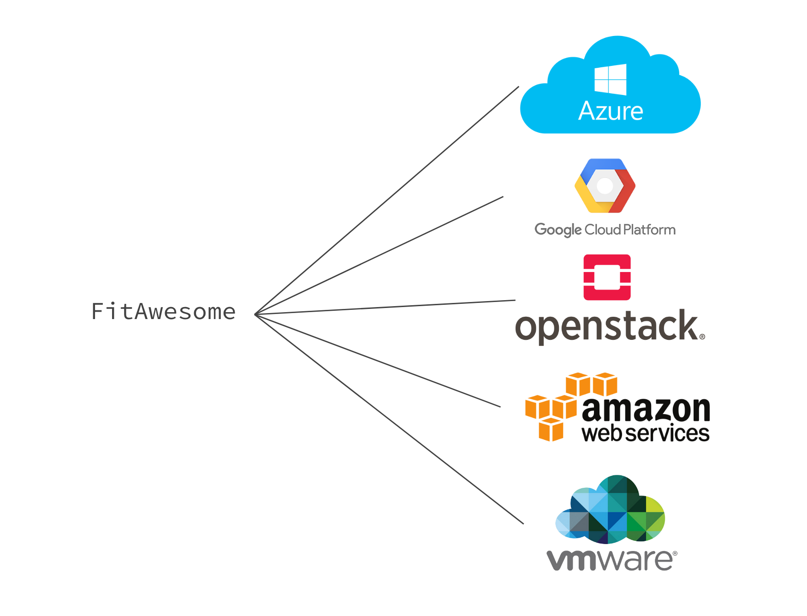
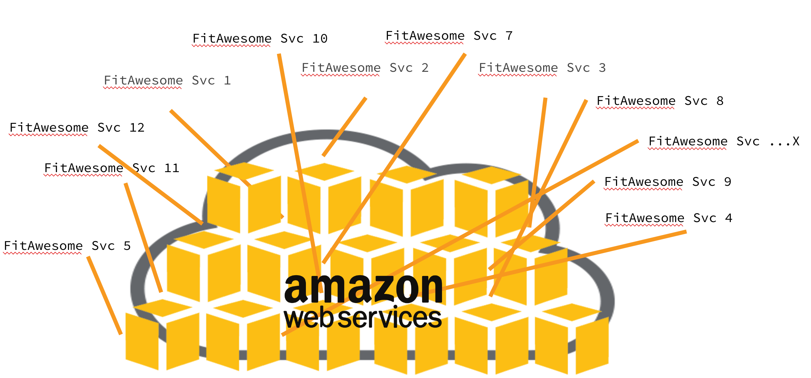
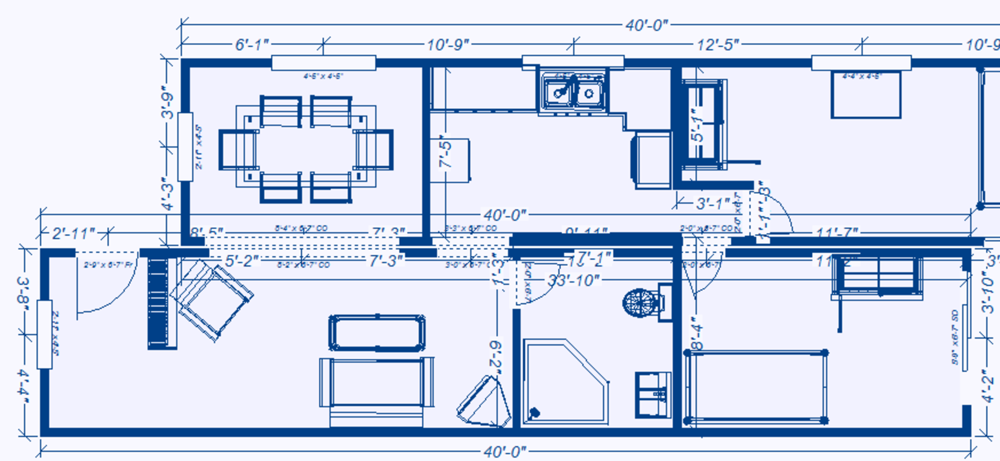
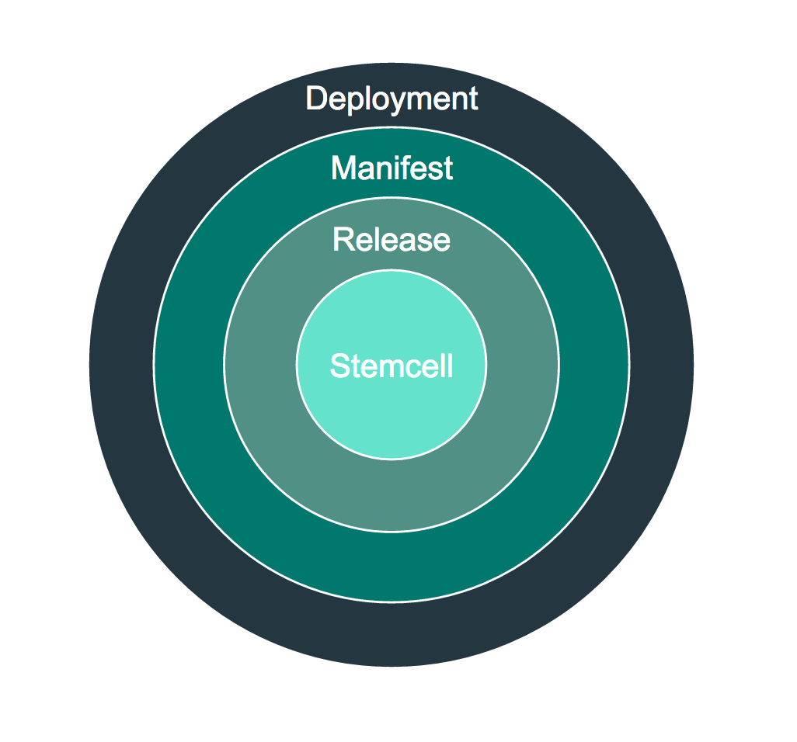

# Simplifying Complex Systems with BOSH |

## Deploying Software (The Old Way)
- You have an awesome software product that will transform the fitness industry
- Have to decide where to run your product -- AWS it sounds trendy!

 
- Start out running 1 VM - not too bad, easy enough to manage.
- App continues to mature pulling in more services which then requires more VMs.
- Still manageable

 

- Dev went well, we have all of our services and app is ready to launch!

 
- Too hard to manage all these services!
  - AWS S3 for storage
  - AWS VPC / Route 53 for networking
  - AWS CLI to manage all this....just too hard.

## Updating Software (The Old Way)
- Which VM/OS will be need to be updated?
- Will all the services need to be updated or just a few?
- How can we update without a product outage?

 #### Security Patching brings more questions
- How am I supposed to know about the security vulnerability?
- Are my services using the affected code?

 __"I'm an IT operator not a app developer nor the security expert! *This is too hard!*"__

___
## There's a better way! __BOSH__ |
- Explicit Resource Definition
  - Tells us what exactly is being used and in what manner
- Reproducible
  - Follows the same steps time over time to produce what is needed
- Guaranteed Consistency
  - Always utilizes the same code for every deployment from down deep (OS) to up top (processes)
- Fast & Agile
  - Only updates what is required when it is required (Continuous Integration :+1:)

## Understanding the Magic

#### Lets start with the core and build out

- __Stemcell__: Each VM BOSH creates for you starts with a Stemcell - Foundation
  - Consists of a Operating System and base libraries
  - Minimal/bare as possible
  - Ubuntu Trusty or CentOS 7.x

   

- __Release__: The src that is intended to run - Building Materials
  - Versioned
  - Properties/ Configs
  - Startup Scripts
  - Source Code
  - Binaries
  - Anything required to get the software product running

   

- __Manifest__: Instructions for running the product - Blue Prints
  - Controls how and what you want to run

   

- __Deployment__: All together these make a deployment
  - The final result

   

#### Simple
  - The configuration of the 15+ services we had earlier is not simplified into a single command `bosh deploy`

   

## Going Further

#### Stemcell

#### Release

#### Manifest
