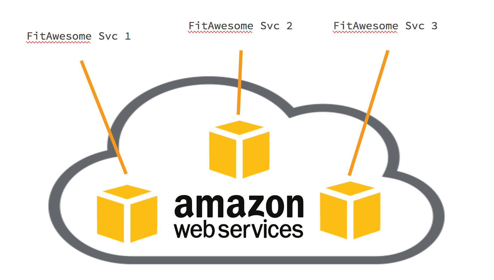

# Simplifying Complex Systems with BOSH |

### Deploying Software (The Old Way)
- You have an awesome software product that will transform the fitness industry
- Have to decide where to run your product -- AWS it sounds trendy!

 
- Start out running 1 VM - not too bad, easy enough to manage.
- App continues to mature pulling in more services which then requires more VMs.
- Still manageable

 

- Dev went well, we have all of our services and app is ready to launch!

 
- Too hard to manage all these services!
  - AWS S3 for storage
  - AWS VPC / Route 53 for networking
  - AWS CLI to manage all this....just too hard.

### Updating Software (The Old Way)
- Which VM/OS will be need to be updated?
- Will all the services need to be updated or just a few?
- How can we update without a product outage?

 #### Security Patching brings more questions
- How am I supposed to know about the security vulnerability?
- Are my services using the affected code?

 __"I'm an IT operator not a app developer nor the security expert! *This is too hard!*"__

___
### There's a better way! __BOSH__ |
- Explicit Resource Definition
  - Tells us what exactly is being used and in what manner
- Reproducible
  - Follows the same steps time over time to produce what is needed
- Guaranteed Consistency
  - Always utilizes the same code for every deployment from down deep (OS) to up top (processes)
- Fast & Agile
  - Only updates what is required when it is required (Continuous Integration :+1:)

### Understanding the Magic

#### Lets start with the core and build out

- __Stemcell__: Each VM BOSH creates for you starts with a Stemcell - Foundation
  - Consists of a Operating System and base libraries
  - Minimal/bare as possible
  - Ubuntu Trusty or CentOS 7.x

   

- __Release__: The src that is intended to run - Building Materials
  - Versioned
  - Properties/ Configs
  - Startup Scripts
  - Source Code
  - Binaries
  - Anything required to get the software product running

   

- __Manifest__: Instructions for running the product - Blue Prints
  - Controls how and what you want to run

   

- __Deployment__: All together these make a deployment
  - The final result

   

#### Simple
  - The configuration of the 15+ services we had earlier is not simplified into a single command `bosh deploy`

   

## Going Further

#### What is BOSH made of? (Draw small boxes/lines diagram of below)
- Single VM - Which all of BOSH runs on
- Director - Core orchestrator of all BOSH components
- Postgres DB - Storing information about the deployment
- NATS - Pub/Sub messaging system to communicate to each VM for instructions and health monitoring
- Blobstore - Storing releases and stemcells
- CPI - Cloud Provider Interface - Layer which abstracts infrastructure differences from the rest of BOSH.
- DNS Server - PowerDNS used to provide resolution between VMs in a deployment
- Agent - Each VM in all deployments has a small Agent which listens for instructions from the Director and then carries them out.
- ***TODO*** Maybe others I have forgotten?

#### Step 0 - Get BOSHed

- A single BOSH environment consists of the Director and the deployments that it orchestrates. To start, we need to deploy the director.
- Determine the infrastructure that is correct for you:
  - AWS
  - Azure
  - OpenStack
  - vSphere
  - vCloud
  - SoftLayer
  - GCP
  - Local (Good for local dev/test/exploration)
- [bosh-it](https://bosh.io/docs/using-bosh-init.html) your director -- automagically included in the cli v2.
- Communicating with your BOSH director:
  - To instruct BOSH to perform tasks or get the status of current deployments we utilize a [CLI](https://bosh.io/docs/bosh-cli.html).
  - While there is an API to talk to the BOSH director, that is not recommended (ever changing).
  - The CLI and BOSH has recently over gone a complete makeover for its release 2.0
  - Old CLI is written in ruby, new is written in Golang, many other changes -- will cover these later.

#### Step 1 - Upload Stemcell
- Problem:
  - Heart Bleed Bug Hits -- How to update all 15 instances on AWS maintaining service without performance hits?
- Solution -- Stemcells!
- Stemcells are:
  - versioned
  - IaaS specifc
  - a bare minimum Operating System image with a BOSH agent
  - offered in two flavors - Ubuntu trusty - CentOS 7.x
  - packaged as tarballs
- Stemcells allow:
  - for a consistent and reproducible base OS
  - versioning of changes to the base OS
  - reuse of OS images across VMs of different types
  - reuse of OS images across different IaaS
- `$ bosh upload stemcell https://bosh.io/d/stemcells/bosh-aws-xen-hvm-ubuntu-trusty-go_agent`

#### Release

#### Manifest

#### BOSH 1.x vs 2.0
